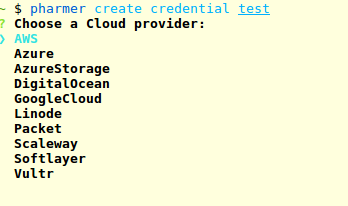

#Credential

For creating cluster `pharmer` needs cloud provider's credential, so that it can create cluster resources on that provider.

`pharmer` provides an interactive shell to help user to provider credential information.



### Creating

```bash
$ pharmer create credential -h
Create  credential object

Usage:
  pharmer create credential [flags]

Aliases:
  credential, credentials, cred, Credential

Examples:
pharmer create credential

Flags:
  -l, --from-env           Load credential data from ENV.
  -f, --from-file string   Load credential data from file
  -h, --help               help for credential
  -p, --provider string    Name of the Cloud provider

Global Flags:
      --alsologtostderr                  log to standard error as well as files
      --analytics                        Send analytical events to Google Guard (default true)
      --config-file string               Path to Pharmer config file
      --env string                       Environment used to enable debugging (default "dev")
      --log_backtrace_at traceLocation   when logging hits line file:N, emit a stack trace (default :0)
      --log_dir string                   If non-empty, write log files in this directory
      --logtostderr                      log to standard error instead of files (default true)
      --stderrthreshold severity         logs at or above this threshold go to stderr (default 2)
  -v, --v Level                          log level for V logs
      --vmodule moduleSpec               comma-separated list of pattern=N settings for file-filtered logging
```


To import a cloud provider credential run the following command
```bash
$ pharmer create credential <credential-name>
```
This command will show you an interactive shell through which you can import your credentials easily.

if your want to import the credential from a file(e.g. for google cloud provider), then you need to run

```bash
$ pharmer create credential <credential-name> --config=<path-to-your-credential-file>
```

To see your credential run
```yaml
$ pharmer get credentials vultr -o yaml
apiVersion: v1alpha1
kind: Credential
metadata:
  creationTimestamp: 2017-10-26T11:31:26Z
  name: <credential-name>
spec:
  data:
    <your-credential-data>
  provider: <cloud-provider-name>

``` 

Here, 
 - `meteadata.name` is your cloud credential name
 - `spec.data` contains the cloud credentials as `key: value` format
 - `spsc.provider` is your cloud provider name

If you use local storage can also see the stored credential from the following location:
```bash
$ cd ~/.pharmer/store.d/credentials/
```

### Editing

Using `pharmer` you can update your existing credentials.


To show the all credentials available on your storage run the following command
```bash
$ phamer get credentials  
```  


To update your credentials, run
```bash
$ pharmer edit credentials <credential-name>
```
**N.B:** Here you can only modify the data section.

### Deleting

If you want to delete your existing credentials, then you need to run

```bash
$ pharmer delete credentials <credential-name>
```  


 